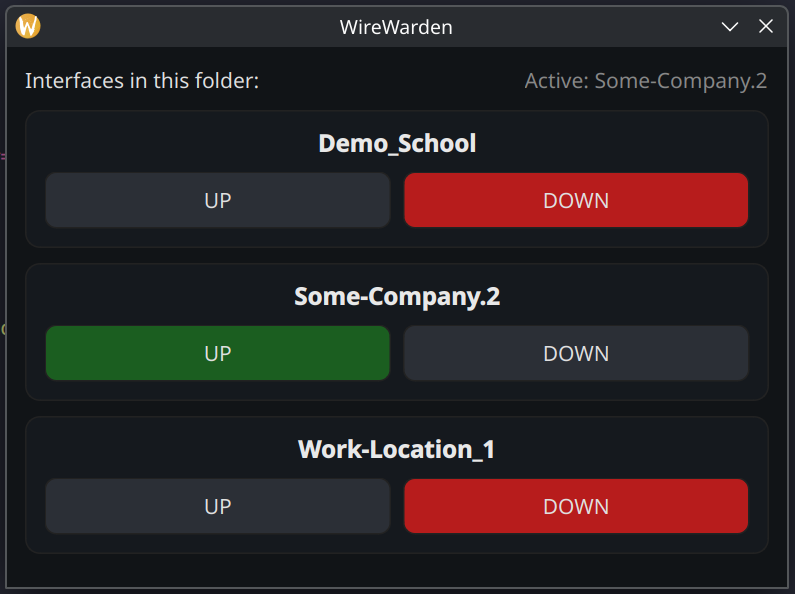

# 🛡️ WireWarden

**WireWarden** is a lightweight **PyQt6 GUI** for managing **WireGuard
VPN tunnels** on Linux.\
It detects `.conf` files automatically, shows each connection with clear
color indicators, and lets you bring tunnels **up or down with one
click** --- no terminal required.

------------------------------------------------------------------------

## ✨ Features

-   🔍 Auto-detects all `.conf` files\
-   🟢 Red/green buttons show live connection status\
-   🚫 Prevents multiple tunnels from running at once\
-   ⚠️ Warns if config filenames contain invalid characters\
-   🔄 Automatically refreshes interface status every few seconds\
-   🧠 Simple, readable Python source built with **PyQt6**

------------------------------------------------------------------------

## 📸 Screenshot



*Main interface showing active tunnel detection and status indicators.*
```

------------------------------------------------------------------------

## Requirements

-   Linux system with **WireGuard** installed (`wg`, `wg-quick`)
-   Python ≥ 3.9\
-   `PyQt6` installed:

``` bash
pip install PyQt6
# or
pip install -r requirements.txt
```

------------------------------------------------------------------------

## Run It

### Option 1 --- Run from Source

Clone the repo and launch:

``` bash
git clone https://github.com/cculver78/WireWarden.git
cd WireWarden
python3 WireWarden.py
```

Place your `*.conf` files in the same folder as the script.

------------------------------------------------------------------------

### Option 2 --- Compile to Standalone Executable (Recommended)

Run the included compile script:

``` bash
chmod +x compilelinux.sh
./compilelinux.sh
```

After compiling:

-   Place your WireGuard `*.conf` files in:

``` bash
$HOME/WireWarden
```

-   Create a shortcut to the generated executable on your desktop or
    preferred application launcher.

This method provides a cleaner deployment experience and avoids running
the app directly from source.

------------------------------------------------------------------------

## 🧪 Tested On

WireWarden has been tested and confirmed working on:

-   Debian 13\
-   Fedora 42\
-   Ubuntu\
-   CachyOS

Other modern Linux distributions should work as long as WireGuard and
required dependencies are installed.

------------------------------------------------------------------------

## Desktop Integration

To launch from your system menu, create:

`~/.local/share/applications/WireWarden.desktop`

``` ini
[Desktop Entry]
Name=WireWarden
Comment=Simple PyQt6 GUI for WireGuard VPNs
Exec=pkexec python3 /path/to/WireWarden/WireWarden.py
Icon=network-vpn
Terminal=false
Type=Application
Categories=Network;System;
StartupNotify=true
```

If using the compiled version, update the `Exec=` path to point to the
generated executable instead of the Python script.

------------------------------------------------------------------------

## License

Released under the **MIT License** --- free to use, modify, and share,
provided the original copyright notice and credit to **Charles Culver**
remain.

------------------------------------------------------------------------

## Concept

WireWarden was built for sysadmins, homelab enthusiasts, and
privacy-minded users who prefer a clean visual controller over the
command line.

------------------------------------------------------------------------

## Author

**Charles "Chuck" Culver**\
[GitHub](https://github.com/cculver78) •
[Bluesky](https://bsky.app/profile/dhelmet78.bsky.social) •
[Threads](https://www.threads.com/@cculver78)

------------------------------------------------------------------------

# Known Issues / Fixes

### "A terminal is required to read the password"

This appears when no graphical authentication agent is present.\
Install `pkexec`, the `polkit` daemon, and a desktop-specific agent:

``` bash
sudo apt install pkexec polkitd polkit-kde-agent-1
```

If you're using GNOME, use this instead:

``` bash
sudo apt install policykit-1-gnome
```

Then log out and back in (or reboot) so the agent starts properly.\
You'll now see a GUI password prompt when WireWarden needs elevated
access.

------------------------------------------------------------------------

### "/usr/bin/wg-quick: line 32: resolvconf: command not found"

This occurs if your WireGuard config includes a `DNS=` line but the
system lacks a `resolvconf` provider.\
Install one of these packages to fix it:

``` bash
sudo apt install resolvconf
# or
sudo apt install openresolv
```

After installation, bring the interface back up and DNS will configure
correctly.
